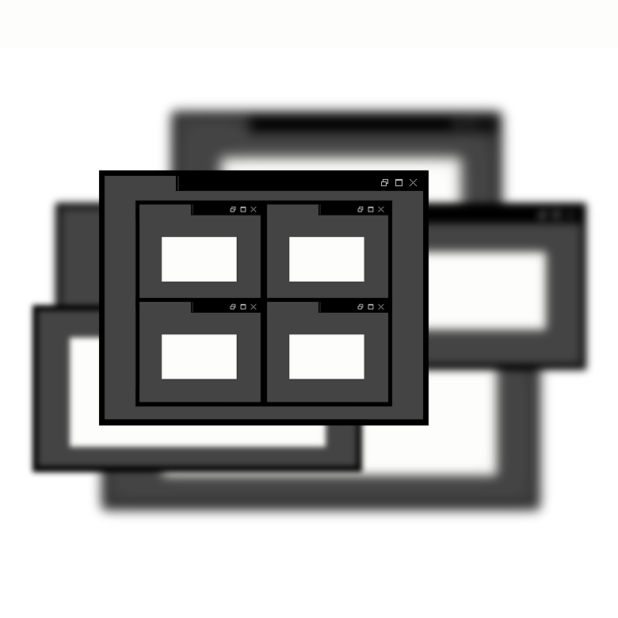

[example_online]: https://githubbox.com/idealjs/layout-manager/tree/main/example
[example_folder]: https://github.com/idealjs/layout-manager/tree/main/example

# Layout Manager

Building Multi-Window Application's Frameworkless Library



## Use directly with Grape Layout

Built on React

```
npm install @idealjs/grape-layout
```

### Example

For more details you can check

-   [CodeSandbox][example_online]
-   [Example Create by CRA][example_folder]

## Features

## Get Start

### Install

```
npm install @idealjs/layout-manager @idealjs/portal-window @idealjs/dnd-react @idealjs/sns-react
```

## Roadmap


## Support

